<div align="center">


<br/>



<br/><br/>

<a href="https://git.io/typing-svg">
  
</a>

<br/><br/>

> *「花は桜木、人は武士」*
>
> *Among blossoms, sakura. Among builders, discipline.*

**Full Stack Engineer · Automation Specialist · CTO @ NexusSoft**  
Java, Spring Boot, React, Angular, APIs, cloud deployments, and the stubborn habit of improving every iteration.

<br/>

[](https://linkedin.com/in/jose-emmanuel-quintana-torres-22a953232)
[](mailto:quintanatorresjoseemmanuel1dm@gmail.com)
[](https://github.com/emmanuelquintana)

</div>

<br/>

---

<div align="center">

## 🌸 &nbsp; 生きがい &nbsp; — &nbsp; About Me


</div>

```java
class JoseEmmanuel {

    String   name       = "Jose Emmanuel Quintana Torres";
    String   role       = "Full Stack Engineer · Automation Specialist · CTO";
    String   location   = "Ecatepec de Morelos, México 🇲🇽";
    int      experience = 8; // years forging software

    String[] now = {
        "Building cloud-scale banking systems @ Banregio",
        "Leading NexusSoft as Founder & CTO",
        "Pursuing MSc in Artificial Intelligence @ UNIR México"
    };

    String[] crafts = { "Java", "Spring Boot", "React", "Angular",
                        "MuleSoft", "Apigee", "NestJS", "Docker" };

    String   aesthetic = "夜桜 · pixel art · clean architecture · disciplined craft";
    String   animeFuel = "My Hero Academia — Deku mindset: analyze, train, protect, go beyond";
    String   philosophy = "一期一会 — Each project, a once-in-a-lifetime craft";
}
```

<br/>

---

<div align="center">

## ⛩️ &nbsp; 道 &nbsp; — &nbsp; Path of Experience


</div>

```
🌸  2024 ──────── Now   │  NexusSoft          │  Founder & CTO
🌸  2022 ──────── Now   │  Banregio            │  Full Stack Developer
🌸  2018 ──────── 2022  │  Mx Racing           │  Web Developer
🌸  2016 ──────── 2022  │  Equipo Sonríe       │  Web Developer
```

<br/>

**🏯 Banregio** &nbsp; ` 2022 — Present `

Backend services with Java Spring Boot · REST APIs for the banking sector · Angular & TypeScript interfaces · MuleSoft & Google Apigee API integration · OpenShift / Kubernetes cloud deployments · JUnit & Mockito testing

**🏯 NexusSoft** &nbsp; ` 2024 — Present ` &nbsp; *Founder & CTO*

Custom software studio · SaaS products with React, NestJS & Supabase · Digital transformation projects · Full product lifecycle: architecture → design → delivery → support

<br/>

---

<div align="center">

## ⚔️ &nbsp; 武器 &nbsp; — &nbsp; Tech Arsenal


</div>

<div align="center">

### 🎋 Frontend


### ⚔️ Backend


### 🌊 API & Integration


### ☁️ Cloud & DevOps


### 🗄️ Databases


</div>

<br/>

---

<div align="center">

## 🌸 &nbsp; 作品 &nbsp; — &nbsp; Featured Projects


| 🌸 Project | 🎋 Description | ⚔️ Stack |
|:---|:---|:---|
| **🔗 LinkPulse** | SaaS URL shortener with real-time analytics, workspaces & billing | Next.js 15, NestJS, Supabase, Redis, Stripe |
| **🔐 Veyra Vault** | Client-side encrypted password manager (AES-GCM · PBKDF2) | React, Express, Supabase, Prisma |
| **📋 TaskGlass** | Productivity app with workspaces, boards & structured logging | NestJS, Prisma, Supabase, Swagger |
| **🛒 Marketplace Utils** | Tools suite for Liverpool, Shein & TikTok Shop | React 19, FastAPI, Selenium |
| **⬇️ My Downloader** | Multimedia download & batch conversion platform | Next.js 16, Tailwind CSS |

</div>

<br/>

---

<div align="center">

## 📊 &nbsp; 統計 &nbsp; — &nbsp; GitHub Stats


<br/>


&nbsp;&nbsp;


<br/><br/>


<br/><br/>


</div>

<br/>

---

<div align="center">

## 🎓 &nbsp; 学び &nbsp; — &nbsp; Education & Certifications


</div>

**📚 Education**

- 🌸 &nbsp; **Maestría en Inteligencia Artificial** — UNIR México, Universidad Internacional de La Rioja &nbsp; *(2023 — En curso)*
- 🌸 &nbsp; **Ingeniería en Sistemas Computacionales** — Universidad Oparín, S.C. &nbsp; *(2014 — 2018)*

**📜 Certifications**

- 🎋 &nbsp; **Scrum Foundation Professional Certificate** — SFPC / CertiProf
- 🎋 &nbsp; **Certificado de Git** — OpenBootcamp

<br/>

---

<div align="center">

## 🌸 &nbsp; 繋がり &nbsp; — &nbsp; Connect with Me

<br/>

<a href="https://linkedin.com/in/jose-emmanuel-quintana-torres-22a953232">
  
</a>
&nbsp;
<a href="mailto:quintanatorresjoseemmanuel1dm@gmail.com">
  
</a>

<br/><br/>

*「花は桜木、人は武士」*

*"Among flowers, the cherry blossom — among people, the craftsman."*

<br/>


<br/>


</div>
